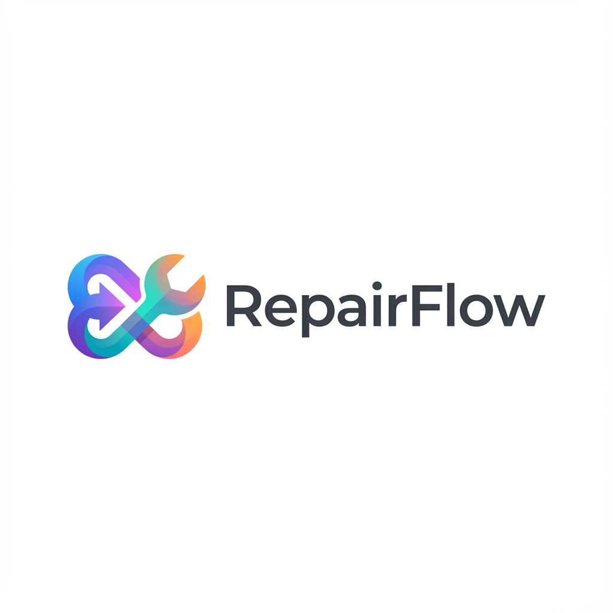

# RepairFlow

<div align="center">



**A comprehensive, open-source repair shop management system built with Next.js 16, designed to streamline operations for phone and device repair businesses.**

[Features](#-features) • [Quick Start](#-quick-start) • [Tech Stack](#-tech-stack) • [Documentation](#-documentation) • [Contributing](CONTRIBUTING.md)

[](https://nextjs.org/)
[](https://www.typescriptlang.org/)
[](https://www.prisma.io/)
[](https://tailwindcss.com/)
[](LICENSE)

</div>

## 🚀 Overview

**RepairFlow** is a modern, full-featured application designed to handle the entire lifecycle of a repair business. From checking in devices and managing inventory to tracking financials, AI-powered receipt scanning, hardware SMS integration, and real-time team chat - RepairFlow provides a unified interface for shop owners and technicians.

Built with the latest web technologies including Next.js 16 App Router, Server Actions, and Prisma ORM with SQLite for a robust and easy-to-deploy solution. Self-hosted with no monthly fees.

## ✨ Features

### 🛠️ Core Operations
- **Ticket Management**: Complete repair lifecycle tracking (Received → In Progress → Waiting for Parts → Repaired → Completed)
- **Status Workflow**: Visual status indicators, automated transitions, and full history tracking
- **Device Tracking**: Record device details (Brand, Model, Serial/IMEI, Color) with photo uploads for device condition
- **Print System**: Generate professional PDF invoices and repair labels with QR code support
- **Thermal Printing**: Direct integration with thermal label printers (40x20mm format)

### 💰 Finance & Accounting
- **Payment Tracking**: Track partial/full payments, refunds, deposits, and multiple payment methods
- **Price Adjustments**: Complete audit trail for any price changes made to tickets
- **Expenses Management**: Record shop expenses and categorize them by type
- **Automated Journaling**: Double-entry bookkeeping system that automatically records all financial events
- **Dashboard Analytics**: Real-time revenue, COGS (Cost of Goods Sold), profit margins, and business health metrics
- **Returns Processing**: Handle customer returns with automatic inventory restoration and refund tracking

### 🤖 AI-Powered Features
- **AI Vision OCR**: Scan supplier receipts/invoices using **Google Gemini**, **OpenAI GPT-4**, or **Anthropic Claude** to automatically extract part data and update inventory
- **Smart Recognition**: Tesseract.js client-side OCR for quick text extraction from device screens and documents
- **Duplicate Detection**: AI-powered receipt fingerprinting to prevent duplicate inventory entries
- **Auto Translation**: Scripts to automatically translate missing i18n keys across all supported languages

### 📦 Inventory & Suppliers
- **Parts Management**: Track stock levels, costs, reorder points, and selling prices
- **Low Stock Alerts**: Dashboard notifications for items running low
- **Supplier Database**: Manage supplier contacts, track purchase history
- **Receipt Scanning**: AI-powered bulk import of parts from supplier invoices
- **Inventory Adjustments**: Track all stock changes with audit trail

### 🤝 Customer Relations (CRM)
- **Customer Profiles**: Detailed history of all repairs, purchases, and communications
- **Satisfaction Ratings**: Collect customer feedback with email-verified ratings
- **Contact Messages**: Built-in contact form with ticket linking
- **Public Tracking**: Dedicated public portal for customers to check repair status using ticket number

### 💬 Team Collaboration
- **Real-time Chat**: Built-in team chat for collaboration on tickets
- **Ticket Discussions**: Link chat conversations directly to repair tickets
- **Notifications**: In-app notification system for assignments, status changes, and updates
- **User Preferences**: Customizable notification preferences per user

### 🔌 Hardware Integrations
- **Hardware SMS**: Direct integration with GSM modems via **Serial/COM port** for cost-effective, carrier-independent SMS messaging
- **Label Printers**: Formatted output for standard thermal label printers
- **QR Code Generation**: Automatic QR codes for customer tracking

### ✉️ Email & SMS Automation
- **Email Templates**: Customizable email templates for customer notifications
- **SMTP Configuration**: Self-hosted email sending via any SMTP provider
- **SMS Templates**: Multi-language SMS templates with variable substitution
- **Automated Notifications**: Trigger notifications on status changes

### 🌍 Internationalization
- **Multi-language Support**: Fully localized interface in **English**, **French**, and **Arabic**
- **RTL Support**: Complete right-to-left layout support for Arabic
- **i18n Automation**: Scripts to scan, check, and auto-fix translation keys
- **Translation Reports**: Generate comprehensive i18n coverage reports

### 🔐 Security & Access Control
- **Role-Based Access**: Admin and Staff roles with granular permissions
- **NextAuth.js v5**: Secure authentication with session management
- **Password Reset**: Email-based password recovery flow
- **Login Logging**: Track login attempts and session activity

### 🖥️ Desktop App (Tauri)
- **Native Desktop**: Build standalone Windows/Mac/Linux apps with Tauri
- **Local Database**: Self-contained SQLite database
- **Hardware Access**: Direct access to serial ports for GSM modems
- **Offline Capable**: Full functionality without internet connection

## 🏗️ Tech Stack

| Category | Technology |
|----------|-----------|
| **Framework** | [Next.js 16](https://nextjs.org/) (App Router, Server Actions) |
| **Language** | [TypeScript](https://www.typescriptlang.org/) 5.3 |
| **Database** | [SQLite](https://sqlite.org/) (Desktop) / [PostgreSQL](https://www.postgresql.org/) (Web) via [Prisma ORM](https://www.prisma.io/) 6.8 |
| **Styling** | [Tailwind CSS](https://tailwindcss.com/) & [Radix UI](https://www.radix-ui.com/) |
| **Authentication** | [NextAuth.js v5](https://authjs.dev/) (Auth.js) |
| **PDF Generation** | [@react-pdf/renderer](https://react-pdf.org/) |
| **Charts** | [Recharts](https://recharts.org/) |
| **OCR/Vision** | Tesseract.js + Gemini/OpenAI/Claude APIs |
| **Forms** | React Hook Form + Zod validation |
| **Desktop** | [Tauri](https://tauri.app/) v2 |

## ⚡ Quick Start

### Prerequisites
- Node.js 18+ (LTS recommended)
- npm 9+

### Installation

1. **Clone the repository**
   ```bash
   git clone https://github.com/cranknet/repairflow.git
   cd repairflow
   ```

2. **Install dependencies**
   ```bash
   npm install
   ```

3. **Environment Setup**
   ```bash
   cp .env.example .env
   ```
   
   Generate a secure secret:
   ```bash
   # PowerShell
   [Convert]::ToBase64String([System.Text.Encoding]::UTF8.GetBytes((New-Guid).ToString()))
   # Bash
   openssl rand -base64 32
   ```

4. **Database Setup**
   ```bash
   npm run db:push
   npm run db:seed  # Optional: Adds sample data
   ```

5. **Run the Development Server**
   ```bash
   npm run dev
   ```
   
   Open [http://localhost:3000](http://localhost:3000) in your browser.

### Default Credentials
After seeding, login with:
- **Email**: `admin@repairflow.local`
- **Password**: `admin123`

## 📂 Project Structure

```
├── src/
│   ├── app/                 # Next.js App Router pages & API
│   │   ├── (main)/          # Authenticated application routes
│   │   ├── (setup)/         # First-time setup wizard
│   │   ├── api/             # Backend API endpoints
│   │   └── track/           # Public tracking pages
│   ├── components/          # React components
│   │   ├── chat/            # Real-time chat components
│   │   ├── dashboard/       # Dashboard widgets & charts
│   │   ├── finance/         # Expense & journal components
│   │   ├── inventory/       # Stock management
│   │   ├── layout/          # App shell & navigation
│   │   ├── settings/        # Configuration panels
│   │   ├── tickets/         # Ticket management
│   │   └── ui/              # Shared UI primitives
│   ├── lib/                 # Core business logic (The "Brain")
│   │   ├── finance/         # Double-entry bookkeeping logic
│   │   ├── ai-vision.ts     # AI Receipt scanning integration
│   │   ├── com-port-sms.ts  # Serial port SMS handling
│   │   ├── prisma.ts        # Database client instantiation
│   │   └── ...              # Shared logic for auth, formatting, etc.
│   └── types/               # TypeScript definitions
├── prisma/
│   ├── schema.prisma        # Database schema
│   └── seed.ts              # Sample data
├── public/
│   └── locales/             # i18n translation files
├── scripts/                 # Automation & maintenance
└── src-tauri/               # Tauri desktop app config
```

## 📚 Documentation

- [Setup Guide](SETUP.md) - Detailed installation and configuration
- [Troubleshooting](TROUBLESHOOTING.md) - Common issues and fixes
- [Versioning](VERSIONING.md) - Release process
- [Operations](OPERATIONS.md) - Production deployment
- [Backup & Restore](BACKUP_RESTORE.md) - Data management
- [Feature Guides](docs/) - In-depth module documentation

## 🛠️ Development Commands

```bash
# Development
npm run dev              # Start dev server
npm run build            # Production build
npm run lint             # Run ESLint

# Database
npm run db:push          # Push schema to database
npm run db:seed          # Seed sample data
npm run db:studio        # Open Prisma Studio

# i18n
npm run i18n:check       # Check for missing translations
npm run i18n:fix:auto    # Auto-fix missing keys

# Desktop App
npm run tauri:dev        # Run Tauri in dev mode
npm run tauri:build      # Build desktop app
```

## 🤝 Contributing

We welcome contributions! Please see our [Contributing Guide](CONTRIBUTING.md) for details on how to submit pull requests, report issues, and the code of conduct.

## 📄 License

This project is licensed under the MIT License - see the [LICENSE](LICENSE) file for details.

---

<div align="center">

Made with ❤️ by the RepairFlow community

[Website](https://repairflow.online) • [Demo](https://demo.repairflow.online) • [GitHub](https://github.com/cranknet/repairflow)

</div>